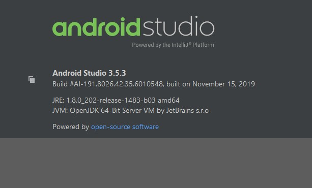
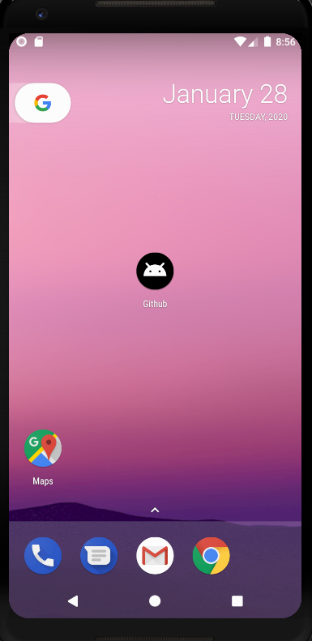

# Android Web App Launcher

This is only a test project but can use for simple applications. The idea is, build a web page like a web application. But instead display the browser, convert it into a app.
Remember that the user has no back- or forward-button within that application and can´t mark certain pages as favorit like in the normal browser. The web application should develop 
with this in mind. Each page have to test if the user can reach all other pages.

**Project build with "androidStudio"**

**Example:**

## Changes you have to do

    1. Change colors of your application (app\src\main\res\values.xml)
    2. Change name / url of your application (app\src\main\res\string.xml)
    3. Change logo of your applicaation (app\src\main\res\drawable-v24\ic_launcher_foreground.xml)
    4. Change package path (app/src/main/AndroidManifest.xml)
        HowTo: https://stackoverflow.com/questions/16804093/rename-package-in-android-studio
        
    