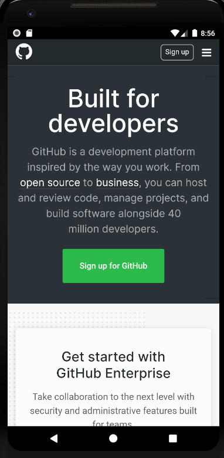

# Android Web App Launcher

This is only a test project but can use for simple applications. The idea is, build a web page like a web application. 
But instead display the page in the browser, convert it into a app. Remember that the user has no back- or 
forward-button within that application and can´t mark certain pages as favorit like in the normal browser. 
The web application should develop with this in mind. Each page have to test if the user can reach all other pages. 
If you have links to other pages outside of your domain, the user will ask if he want to open die page with the standard 
browser.

## How it works

The app contain only a webView which use the complete screen and open a URL within. Each click on the page will 
redirect to the webView and it won´t switch to the normal browser on the mobile device. Also the title bar will hide during 
startup so the complete page can use to display your web app.

You have to develop a complete Web App by using a framework like VUE, React, Angular, Foundation.....

There are some function you can use in your web application to display a "Toast" directly on the mobile device. Also you can 
ask the mobile phone to get the GPS data.

## Environment

**Project build with "androidStudio"**

## Preview

## Changes you have to do

    1. Change colors of your application (app\src\main\res\values.xml)
    
    2. Change name / url of your application (app\src\main\res\string.xml)
    
    3. Change logo of your applicaation (app\src\main\res\drawable-v24\ic_launcher_foreground.xml)
    
    4. Change package path (app/src/main/AndroidManifest.xml)
        HowTo: https://stackoverflow.com/questions/16804093/rename-package-in-android-studio
        
    5. Change the user agent which is used to identify the web application on your domain (app\src\main\res\string.xml)
    
    6. Change the namespace which need in javascript to call the Android functions (app\src\main\res\string.xml)
    
## Simple Web App for testing (Copy code to a file on your domain and point the "app_url" exact to this file.)

        <!DOCTYPE html>
        <html lang="de">
        <head>
            <meta http-equiv="Content-Type" content="text/html; charset=UTF-8">
            <meta name="viewport" content="width=device-width, initial-scale=1.0" />
            <title>My web app</title>
                <link rel="stylesheet" type="text/css" href="css.css">
        </head>
        <body>
        
        <b>Test UserAgent:</b> 
        <?php echo $_SERVER['HTTP_USER_AGENT']; ?> 
        
         
        

         
        
        <b>Test Toast:</b> 
        <input type="button" value="Say hello" onClick="showToast('Hello Android!')" />
        
        
         
        

         
        
        <b>Test GPS:</b> 
        <input type="button" value="Get GPS" onClick="getGps()" />
        
        
         
        

         
        
        <b>Link test:</b> 
        <a href="index.php">Reload</a> 
        <a href="https://developer.android.com/guide/webapps">Other domain</a> 
        
        
        </body>
        </html>
        
    